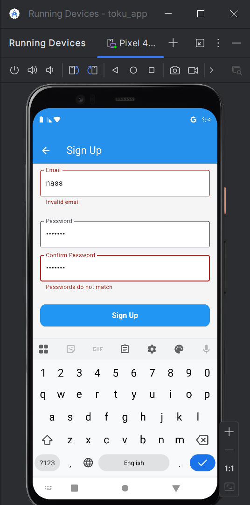

# 🛍️ Flutter Shopping App  

A complete **shopping application** built with Flutter.  
The app features authentication, smooth transitions, localization, and product management.  

---

## 📖 Project Overview  
This project demonstrates a shopping app with:  
- **Welcome Screen** with animations and buttons.  
- **User Authentication** (Sign Up & Sign In).  
- **Smooth transitions** between screens.  
- **Home Screen** with products, grid view, and offers.  
- **Localization**: English 🇬🇧 & Arabic 🇪🇬.  

---

## 🎯 Objectives  
✔ Build a full Flutter shopping app.  
✔ Apply core Dart concepts: variables, functions, OOP.  
✔ Use **Stateless** and **Stateful** widgets.  
✔ Implement **form validation**, **navigation**, and **animations**.  
✔ Add **localization support** (English & Arabic).  

---

## 🛠 Tools & Technologies  
  
  
  
  
  

---

## ✅ Requirements Implemented  

### 🔹 Welcome Screen  
- AppBar with title  
- Local & online images  
- Custom font text  
- Buttons: **Sign Up / Sign In**

### 🔹 Authentication  
- Sign Up form (Full name, Email, Password, Confirm Password)  
- Validation for each field  
- Success dialog: *Account created successfully*  
- Sign In form (Email + Password)  
- Success dialog: *Account sign-in successfully*  

### 🔹 Transitions  
- Smooth **fade animation** between pages  

### 🔹 Shopping Home Screen  
- AppBar with title **Our Products**  
- Horizontal **PageView** for featured products  
- **GridView** with product cards (2 per row)  
- Product card: Image, Title, Add-to-Cart button (Snackbar)  
- **Hot Offers** with `ListView.builder`  

### 🔹 Localization (Bonus)  
- Multilingual app (English & Arabic) using `.arb` files  

---

## ▶️ How to Run  

```bash
# Clone the repository
git clone https://github.com/naeemnasser/Sprint-Microsoft.git
cd Sprint-Microsoft

# Install dependencies
flutter pub get

# Run the app
flutter run
```

## 📸 Screenshots

**Welcome Screen**  


**Sign Up**  


**Sign In**  


**Validation Error**  


**Sign Up With Data**  


**Success Message**  


**Products Grid**  


**Product Details**  


**Welcome (Arabic)**  


**Sign In (Arabic)**  


**Sign Up (Arabic)**  


**Signed In (Arabic)**  


**Products (Arabic)**  


Project Structure
lib/
  main.dart
  screens/
    welcome_screen.dart
    signup_screen.dart
    signin_screen.dart
    home_screen.dart
  widgets/
    custom_button.dart
    custom_textfield.dart
  models/
    product.dart
  l10n/
    app_en.arb
    app_ar.arb
    app_localizations.dart (generated)

Developer

Name: Naeem Nasser
GitHub: naeemnasser

LinkedIn: naeem-nasser
